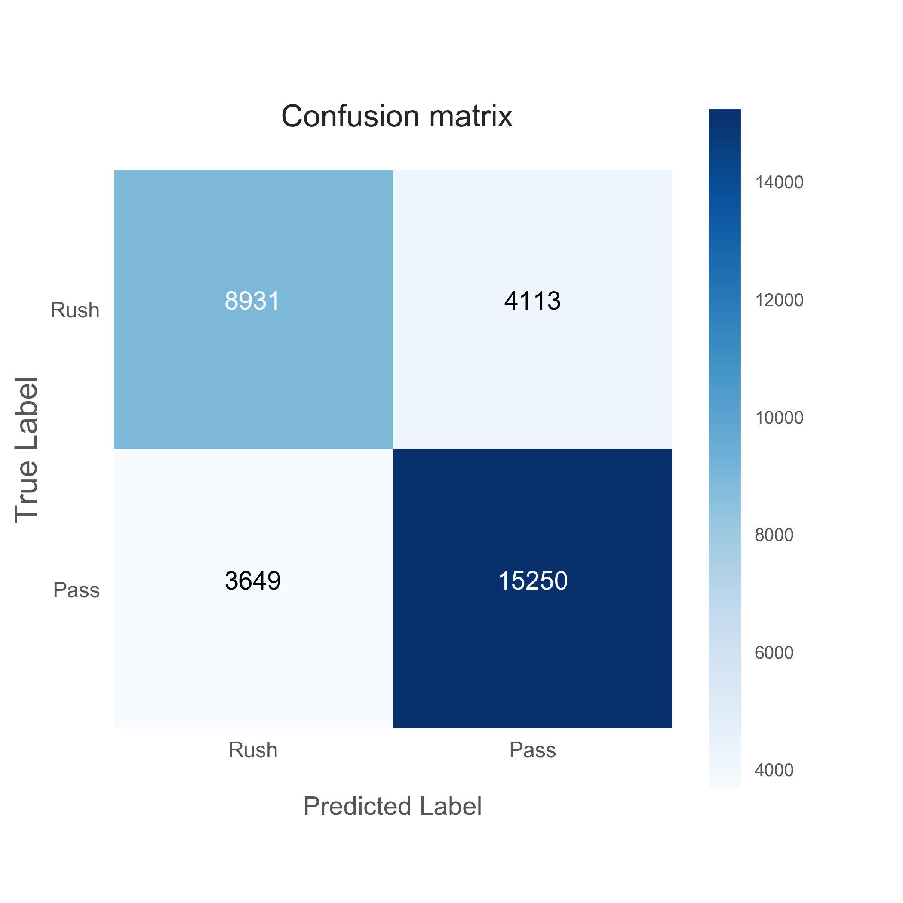
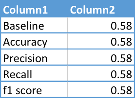

# NFL Play Predictor
#### A binary classifier - Rush vs. Pass

Author: Philip Ramirez 
Date: January 2017

### Motivation
Most work done in sports analytics is related to game scores, outcomes, or player performance forecasting, but modeling game time decisions is a complex - yet potentially fruitful - task. Football is a stop and start game of difficult decisions based on specific game circumstances; It is especially advantageous for coaches and offensive coordinators to be as unpredictable as possible. From the perspective of opposing teams, coaches, and defensive coordinators having a reliable, data driven prediction of the next play would be invaluable. Furthermore, knowing which salient features determine game time decisions can ultimately influence defensive preparation as well as in-game strategy.

### Data
There were three major steps involved in acquiring my final dataset.
* The bulk of my data was sourced by NFLSavant.com. It includes full play by play - including playoffs and Super Bowls - of season years 2013 through 1016.
* I then supplemented this data with scraped features from NFLWeather.com and Pro-Football-Reference.com. Some of these features included temperature, humidity, visibility, coaches, defensive alignments, offensive schemes ...
* The test set (data from season year 2017) was scraped from Pro-Football-Reference.com

The cleaned training data set contains a total of around 120,000 offensive plays ranging from season years 2013 - 2016. This data was split into a training and validation sets in order to tune hyper parameters. Finally, the plays run in 2017 were used as the final test set for model evaluation. After feature engineering and the elimination of redundant features, the final feature set includes 31 columns. Categorical variables were then dummied.

### Model
The model features fall into 7 major categories:
The target is pass. Every pass play attempt is given a value of 1. Every rush attempt is given a value of 0.
Three classifiers were attempted and evaluated. Accuracy, Precision, and Recall are supplied with each model:
	| Model 	             |Accuracy|Precision| Recall |
	|----------------------------|--------|---------|--------|
	| Logistic Regression        | 0.71   | 0.71    | 0.71   |
	| Random Forest classifier   | 0.73   | 0.73    | 0.73   |
	| GradientBoostingClassifier | 0.74   | 0.74    | 0.74   |
	| f1-score        | 0.82 |
  1. Logistic Regression:         0.71, 0.71, 0.71
  2. Random Forest classifier:    0.73, 0.73, 0.73
  3. GradientBoostingClassifier:  0.74, 0.74, 0.74

After grid searching and evaluating models with the use of AWS clusters, the Gradient Boosting Classifier seemed to perform best consistently. The most important features, in order, include <top ten>. After all of the scraping and feature engineering was done, the fundamental factors of football proved to be the most important features.

   
  

### Evaluation
I've evaluated the Gradient Boosting Classifier's performance against a baseline naive model that always selects pass (the majority class).   
  Baseline: 58% accuracy
  GB Classifier: 74% accuracy

{:height="400px" width="400px"} {:height="36px" width="36px"}

#### When compared to the baseline accuracy of 58%, the Gradient Boosting Classifier is 30% more accurate.

### Tech Used
Python
* Pandas and Numpy for data processing and feature engineering
* SciKit Learn Logistic Regression, Random Forest Classifier, Gradient Boosting Classifier, and Grid Search
Database
* MongoDB for data storage/querying
AWS
* iPython clusters of up to 10 EC2 instances to run grid searches of evaluated models

### Future Work
* Player packages for each play
* Baseball - another stop and start sports with complex in game decisions
------|
